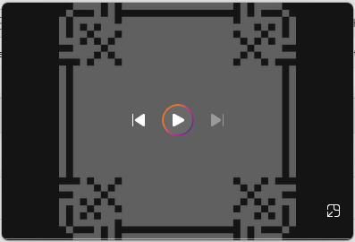
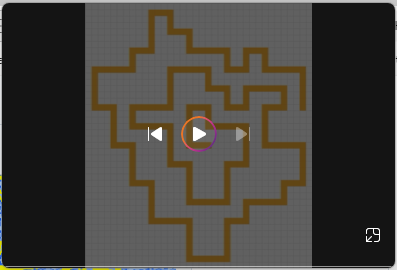
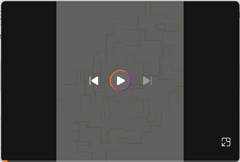
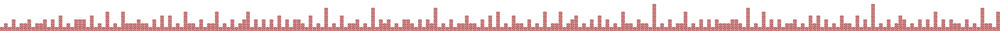
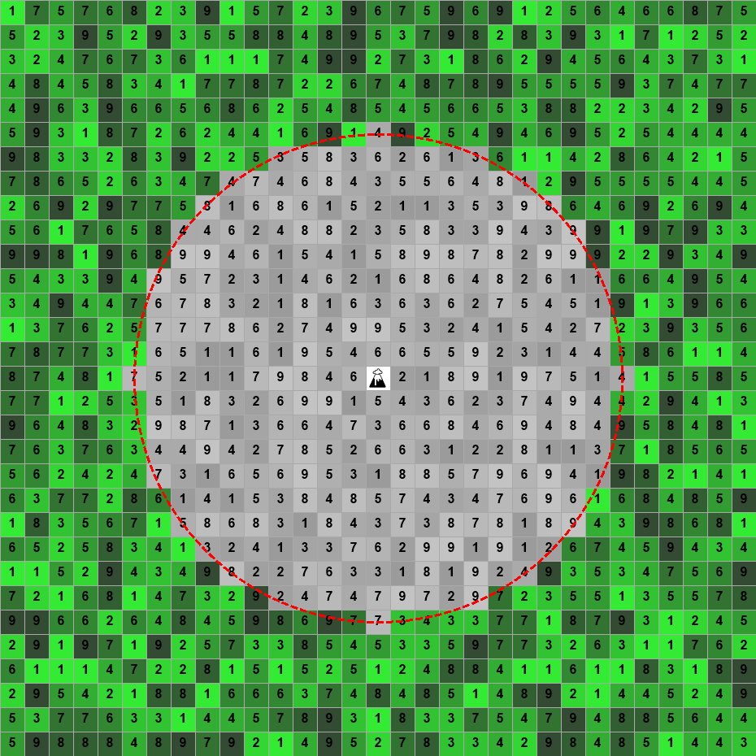
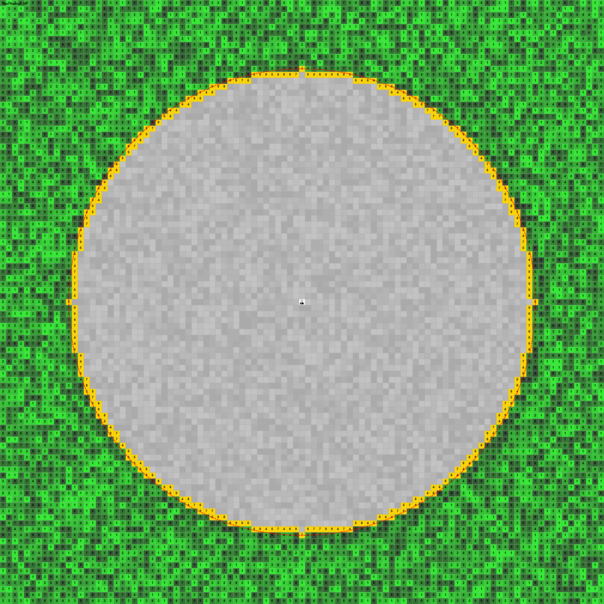
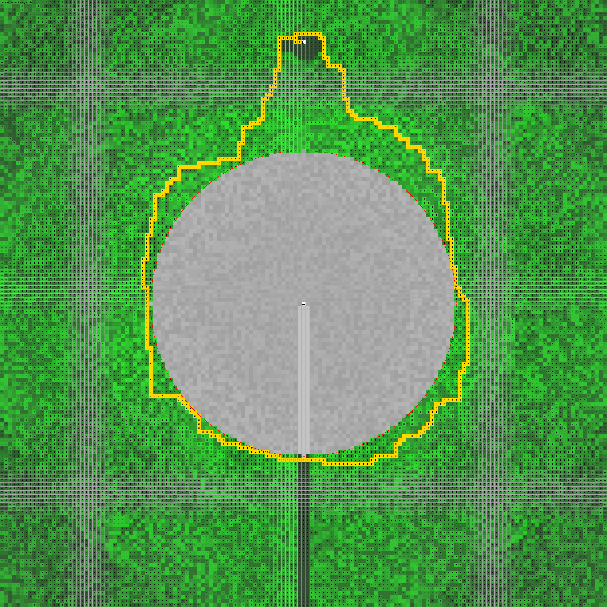
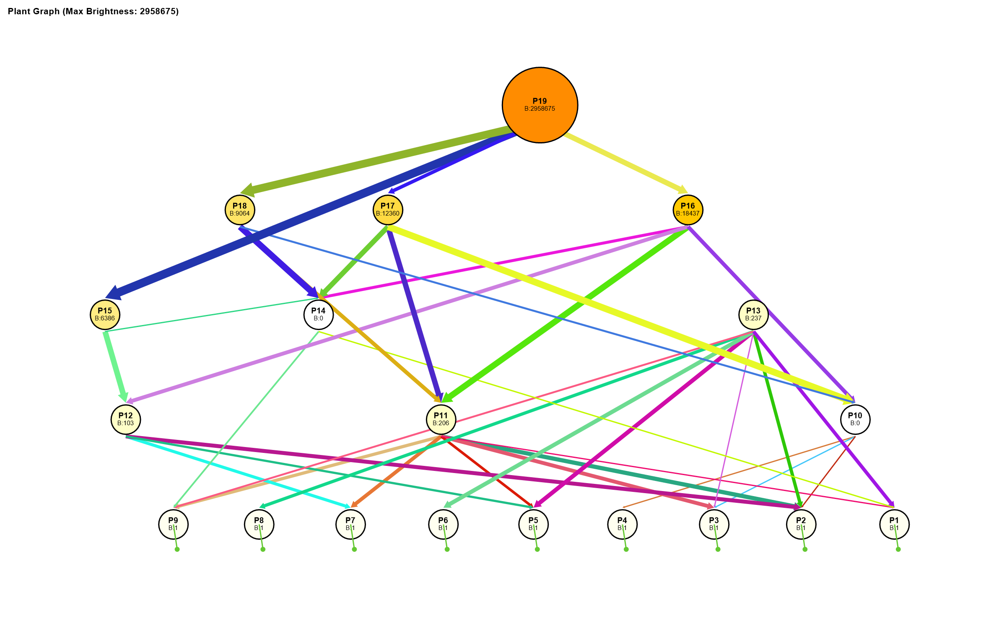

# 2024
| Day | Part 1 | Part 2 | Part 3 |
|-----|--------|--------|--------|

# 2024 Stories 1
| Day | Part 1 | Part 2 | Part 3 |
|-----|--------|--------|--------|

# 2024 Stories 2
| Day | Part 1 | Part 2 | Part 3 |
|-----|--------|--------|--------|

# 2025
| Day | Part 1 | Part 2 | Part 3 |
|-----|--------|--------|--------|
| Quest 2: From Complex to Clarity      | | | |
| Quest 8: The Art of Connection        ||||
| Quest 9: Encoded in the Scales        ||||
| Quest 12: One Spark to Burn Them All  ||||
| Quest 14: The Game of Light           ||||
| Quest 15: Definitely Not a Maze       ||||
| Quest 16: Harmonics of Stone			||||
| Quest 17: Deadline-Driven Development	||||
| Quest 18: When Roots Remember			||||